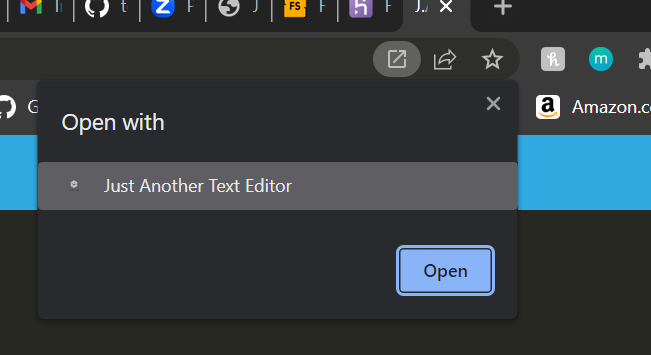

<!-- @format -->

# pwa-text-editor

This project is covered by the MIT license.
https://opensource.org/licenses/MIT;

## Description

A simple text editor app with added functionality that allows it to work as a Progressive Web Application. It can function online as well as off.

## Table of Contents

- [Description](#description)
- [Installation](#installation)
- [Usage](#usage)
- [License](#license)
- [Contributing](#contributing)
- [Tests](#tests)
- [Questions](#questions)

## Installation

Clone from the GitHub repository.

npm run install

npm run start

## Usage

As it opens you have immediate access to the text editor. You can also click the install button to get it run offline.

If the install button does not work you will still be able to install by clicking this button in the browser.

## License

This project is covered by the MIT license.
https://opensource.org/licenses/MIT;

## Contributing

None

## Tests

None

## Questions

Contact [prkrgreenwell](https://github.com/prkrgreenwell) on GitHub with any questions you may have
